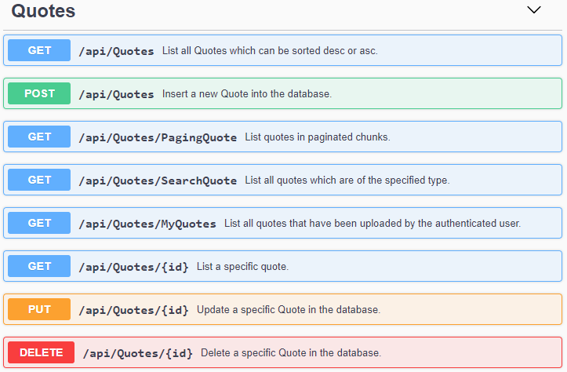

# NETCore-QuotesAPI

This project serves as the code base for a training course regarding building a Web API using .NET Core 2.2.

## API Endpoints

Swagger documentation can be accessed for the project accessing the following endpoint when running the project:
> /swagger

Here is an snippet of the output from Swagger:
<kbd>

</kbd>